# 🛒 Inventory Dashboard — Shop Requirement Tracking

A React 18 + Vite dashboard for submitting shop inventory requirements, browsing requirement history, and reviewing an aggregated purchase summary — backed by a serverless AWS pipeline with dual data-entry flows via a React form and Google Forms / Pabbly Connect.

---

## 📋 Project Overview

The Inventory Dashboard is a fully serverless AWS application that allows shop staff to submit restocking requirements and enables a manager to review an aggregated purchase summary and dispatch it via email. The system supports two parallel data-entry flows: a React form that calls the backend API directly, and a Google Forms → Google Sheets → Pabbly Connect → API Gateway integration that feeds into the same pipeline. All requirements are stored in DynamoDB, summarised automatically via DynamoDB Streams, and the manager can send the final summary via Amazon SNS email subscription with a single button click.

---

## ✨ Key Features

- **Dual submission flow** — requirements can be submitted via the React form (direct API call) or via a Google Form (Google Sheets + Pabbly Connect webhook → same API)
- **Automatic summary generation** — a DynamoDB Streams-triggered Lambda aggregates new PENDING requirements into a `ShopSummary` table in real time
- **Manager email notification** — a single button triggers the `manager-summary` Lambda, which publishes a formatted purchase summary via Amazon SNS email subscription
- **Requirement history** — full history of all submissions with status (PENDING / PROCESSED), sortable by timestamp
- **Purchase summary view** — aggregated quantity per item across all PENDING requirements
- **Tab-based SPA** — switching tabs never reloads the page; all navigation is local React state
- **Auto-refresh** — the dashboard refreshes automatically after a successful requirement submission
- **API key authentication** — all backend Lambda functions validate an `x-api-key` header before processing requests
- **Responsive design** — fully responsive down to mobile; light mode, professional blue theme, glassmorphism CSS; respects `prefers-reduced-motion`

---

## ☁️ AWS Services Used

| Service | Role |
|---|---|
| **Amazon S3** | Static website hosting for the React frontend build |
| **Amazon API Gateway** | HTTP API exposing `/requirements` (POST), `/dashboard` (GET), `/send-summary` (POST) |
| **AWS Lambda** (×4) | `receive-requirement`, `generate-summary`, `dashboard-data`, `manager-summary` |
| **Amazon DynamoDB** | `ShopRequirements` table (with DynamoDB Streams enabled) and `ShopSummary` table |
| **Amazon SNS** | Email subscription topic — manager receives the formatted purchase summary via email |
| **Amazon IAM** | IAM roles and policies for Lambda execution permissions |
| **Amazon CloudWatch** | Lambda function logging and monitoring |

**Additional integrations (external services):**

| Service | Role |
|---|---|
| **Google Forms** | Alternative data-entry UI for shop staff |
| **Google Sheets** | Stores Google Form submissions; Google Apps Script sends entries to Pabbly webhook |
| **Pabbly Connect** | Workflow automation — receives the Apps Script webhook and calls the `/requirements` API |

---

## 🏗️ System Architecture

```
┌─────────────────────────────────────────────────────────────────┐
│                      DATA ENTRY FLOWS                           │
│                                                                 │
│  Flow 1 (Direct)           Flow 2 (Google Forms)               │
│  React Dashboard           Google Form → Google Sheets          │
│       │                         │                              │
│       │  POST /requirements      │  Apps Script → Pabbly        │
│       └──────────┬──────────────┘  Connect webhook              │
└──────────────────┼──────────────────────────────────────────────┘
                   │
                   ▼
           Amazon API Gateway
                   │
                   ▼
         receive-requirement (Lambda)
                   │
                   │  validates x-api-key
                   │  stores item with status = PENDING
                   ▼
           Amazon DynamoDB
           ShopRequirements table
           (DynamoDB Streams enabled)
                   │
                   │  INSERT event stream
                   ▼
         generate-summary (Lambda)
                   │
                   │  aggregates PENDING quantities
                   ▼
           Amazon DynamoDB
           ShopSummary table

─────────────────────────────────────

Browser (Dashboard)
       │  GET /dashboard
       ▼
Amazon API Gateway ──► dashboard-data (Lambda)
                              │
                   ┌──────────┴──────────┐
                   ▼                     ▼
          ShopRequirements          ShopSummary
          (full history)            (aggregated)

─────────────────────────────────────

Manager clicks "Send Summary"
       │  POST /send-summary
       ▼
Amazon API Gateway ──► manager-summary (Lambda)
                              │
                   ┌──────────┴──────────┐
                   │                     │
                   ▼                     ▼
           Amazon SNS              Mark all PENDING
           (email topic)           items → PROCESSED
           Manager email           Clear ShopSummary table
```

Frontend hosted on:

```
Amazon S3 (hosting bucket) — static website
```

---

## 🔄 Project Workflow

1. A shop staff member submits a requirement via either the React dashboard form or a Google Form.
2. **React form path:** the frontend calls `POST /requirements` directly with `{ shopName, item, quantity }` and an `x-api-key` header.
3. **Google Forms path:** the form submission is captured in Google Sheets; a Google Apps Script sends the new row to a Pabbly Connect webhook; Pabbly calls `POST /requirements` on the API Gateway.
4. The `receive-requirement` Lambda validates the API key and input, then stores a new record in the `ShopRequirements` DynamoDB table with `status = PENDING`.
5. The DynamoDB Streams INSERT event triggers the `generate-summary` Lambda, which reads the new item's item name and quantity and upserts (`ADD totalQuantity`) the `ShopSummary` table.
6. The frontend dashboard fetches `GET /dashboard` on load and after each submission. The `dashboard-data` Lambda scans both tables and returns requirements history, summary data, and aggregate metadata.
7. When the manager is ready to place a purchase order, they click **Send Summary** in the dashboard.
8. The `manager-summary` Lambda scans the `ShopSummary` table, builds a formatted plain-text purchase summary, publishes it to the Amazon SNS topic (sending an email to subscribed addresses), marks all PENDING requirements as PROCESSED in `ShopRequirements`, and clears the `ShopSummary` table.

---

## 📸 Screenshots

### 🏠 Home Page

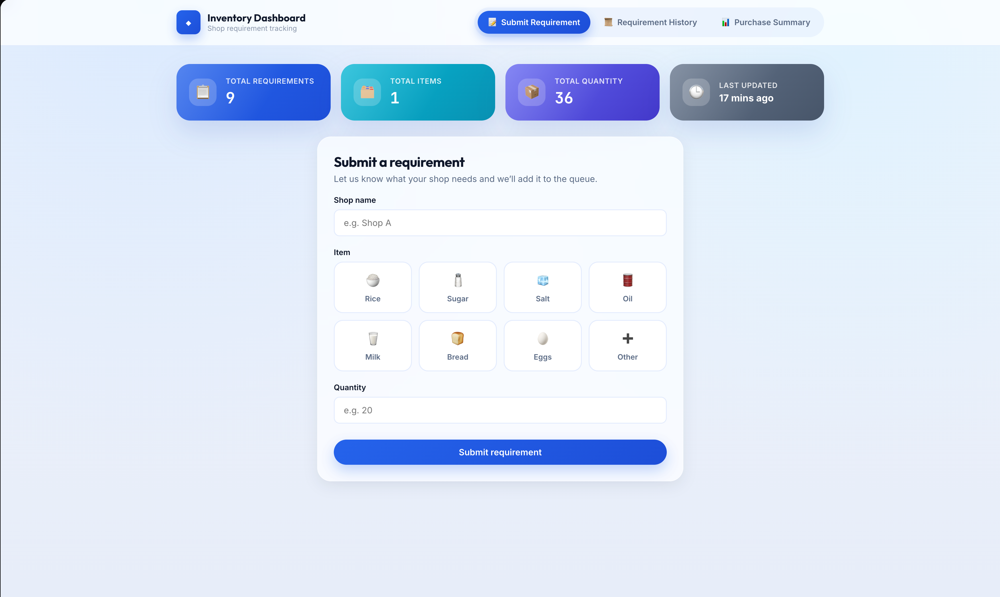

### 📝 React Form Submission

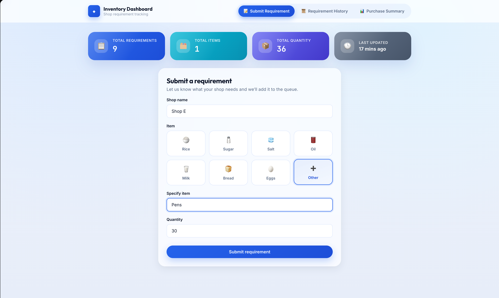

### 📋 Requirements History

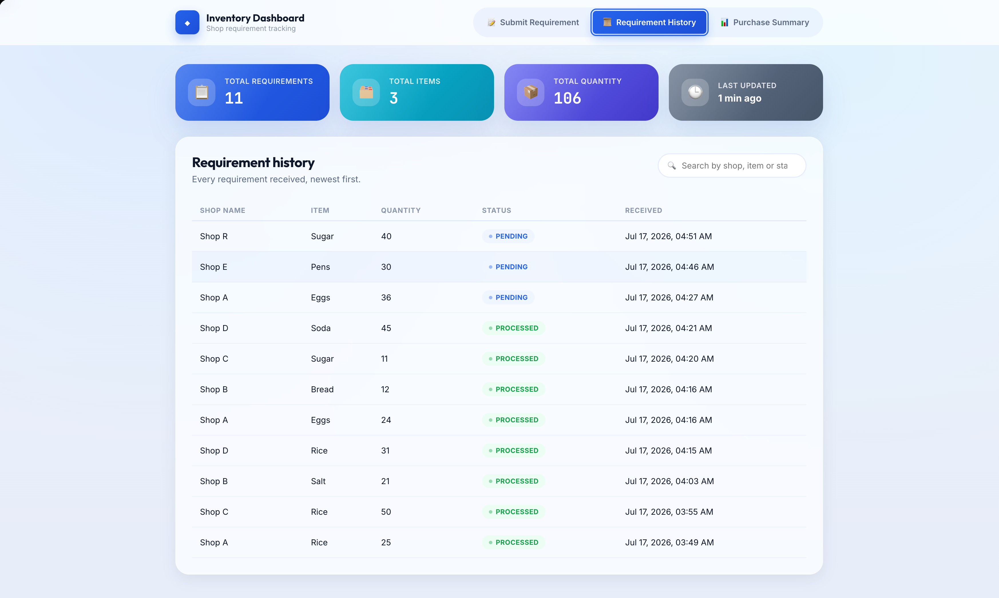

### 📊 Purchase Summary

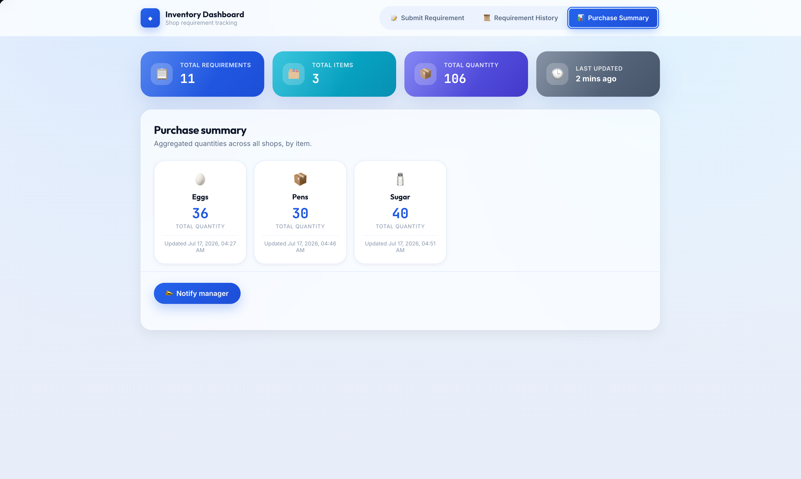

### 📧 Summary Email (SNS)

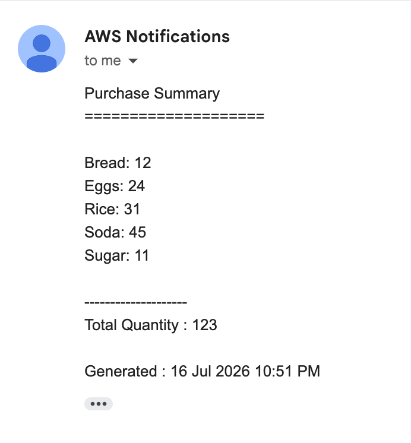

### 🔗 Google Form Submission

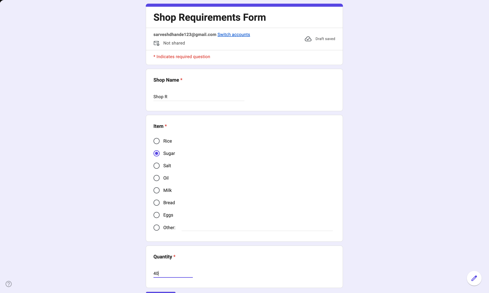

### 📄 Google Sheet

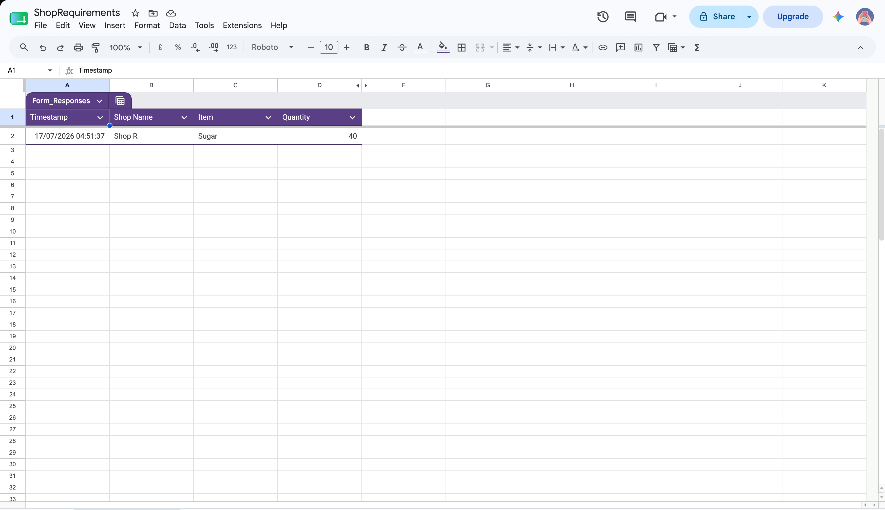

### 🔄 Pabbly Workflow

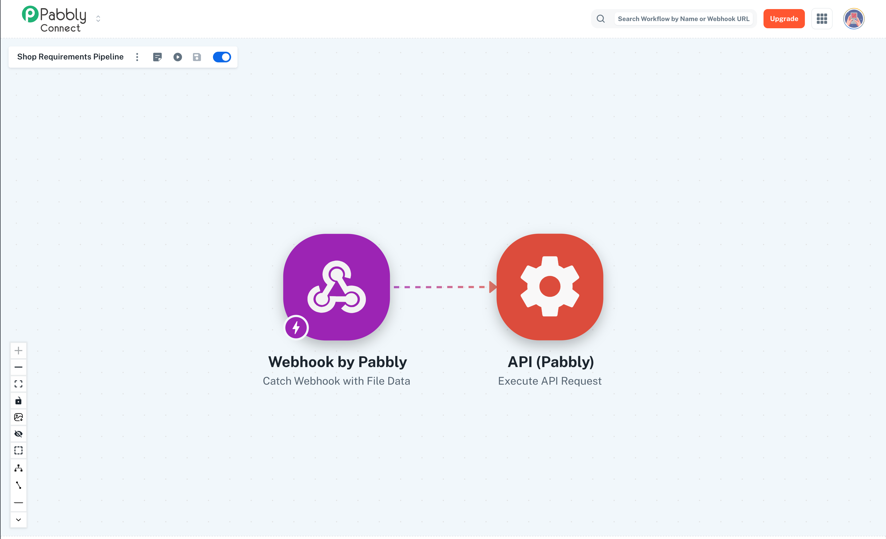

### 🪣 S3 Bucket (Hosting)

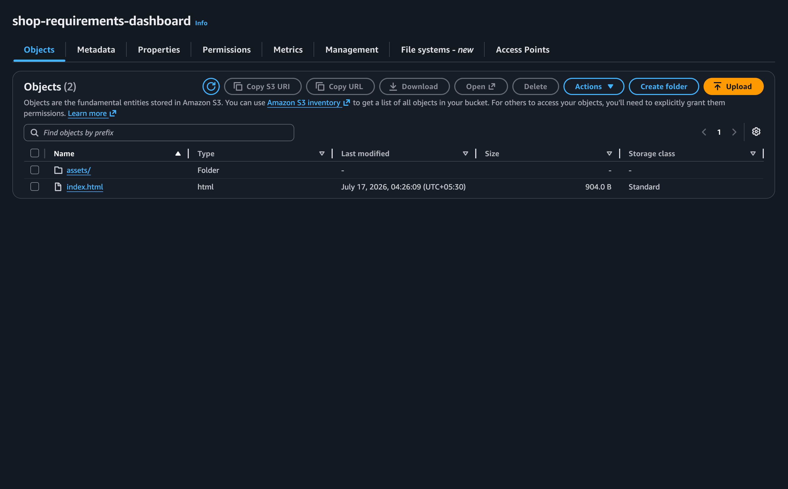

### 🗃️ Shop Requirements Table (DynamoDB)

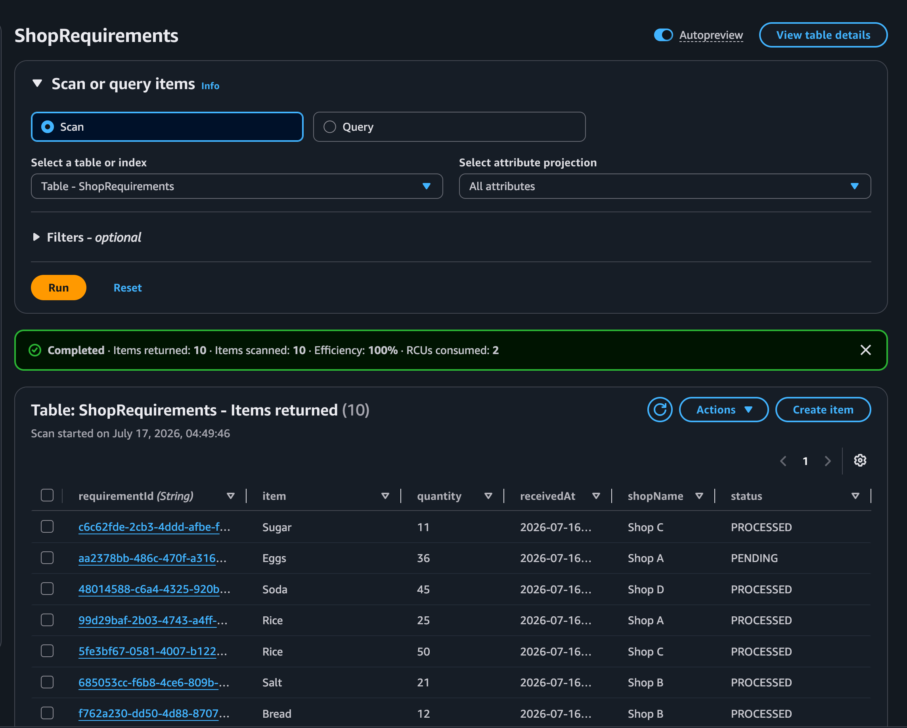

### 📈 Shop Summary Table (DynamoDB)

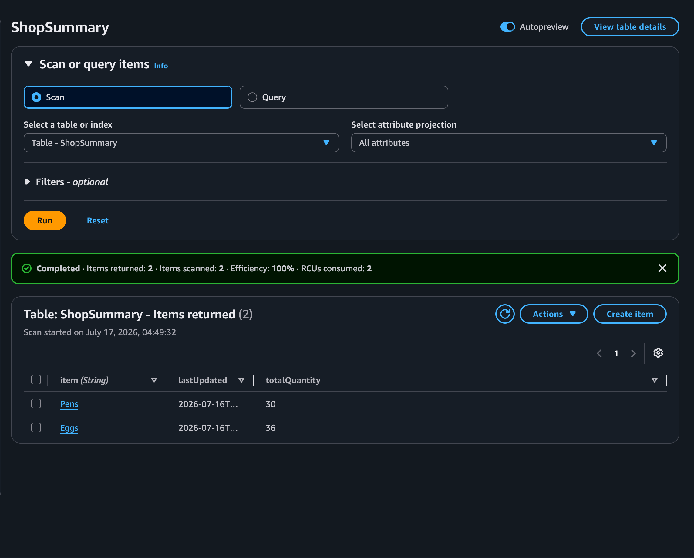

---

## 🔌 REST API Endpoints

Base URL: `https://vj4czkp3r7.execute-api.ap-south-1.amazonaws.com`

| Method | Route | Lambda | Description |
|---|---|---|---|
| `POST` | `/requirements` | `receive-requirement` | Submits a new shop requirement. Body: `{ "shopName": string, "item": string, "quantity": number }`. Requires `x-api-key` header. Returns `201` on success. |
| `GET` | `/dashboard` | `dashboard-data` | Returns requirements history, aggregated summary, and totals metadata. Requires `x-api-key` header. |
| `POST` | `/send-summary` | `manager-summary` | Sends aggregated purchase summary to manager via SNS email, marks all PENDING items as PROCESSED, and clears the summary table. Requires `x-api-key` header. |

All Lambda responses include CORS headers. All endpoints validate the `x-api-key` header and return `401 Unauthorized` if missing or incorrect.

---

## 📁 Repository Structure

```
Shop-Requirements/
├── index.html                          # Vite HTML entry point
├── vite.config.js                      # Vite build configuration
├── package.json                        # npm dependencies (React 18, Vite)
├── src/
│   ├── main.jsx                        # React entry point
│   ├── App.jsx                         # Root component — tab routing via state
│   ├── components/                     # Reusable UI components
│   │   │                               # (Navbar, DashboardCards, ItemSelector,
│   │   │                               #  Toast, Spinner, EmptyState,
│   │   │                               #  ErrorState, AnimatedCounter)
│   ├── pages/                          # Page-level components
│   │   │                               # (SubmitRequirement, RequirementHistory,
│   │   │                               #  PurchaseSummary)
│   ├── services/
│   │   └── api.js                      # All API calls (BASE_URL + fetch; no fetch elsewhere)
│   ├── hooks/                          # Custom React hooks (useDashboard, useToast, useCountUp)
│   ├── utils/                          # Utility functions (formatDate, validators)
│   └── styles/                         # CSS files
│       │                               # (variables.css, global.css, animations.css,
│       │                               #  per-component stylesheets)
├── lambda-functions/
│   ├── receive-requirement/
│   │   └── lambda_function.py          # Stores new requirement in DynamoDB
│   ├── generate-summary/
│   │   └── lambda_function.py          # DynamoDB Streams trigger; aggregates to ShopSummary
│   ├── manager-summary/
│   │   └── lambda_function.py          # Publishes SNS email; marks items PROCESSED
│   └── dashboard-data/
│       └── lambda_function.py          # Returns requirements + summary to frontend
├── project_images/                     # Screenshots for documentation
├── dist/                               # Vite production build output
└── PROJECT_METADATA.md                 # Project metadata
```

---

## 🛠️ Technology Stack

### Frontend

| Technology | Detail |
|---|---|
| React 18 | Functional components and hooks; no Redux, no Context API |
| Vite 5 | Development server and production bundler |
| Plain modern CSS | Custom properties, glassmorphism, gradients; no CSS framework or UI kit |
| `fetch()` API | Centralised in `src/services/api.js`; no `fetch` outside this file |

### Backend

| Technology | Detail |
|---|---|
| Python 3 | All Lambda functions written in Python using `boto3` |
| AWS Lambda | Serverless compute for all backend logic |
| `boto3` | AWS SDK — DynamoDB and SNS clients |

### AWS Infrastructure

| Service | Detail |
|---|---|
| Amazon S3 | Static website hosting for the React build |
| Amazon API Gateway | HTTP API |
| Amazon DynamoDB | `ShopRequirements` + `ShopSummary` tables; DynamoDB Streams |
| Amazon SNS | Email notification subscription topic |
| Amazon IAM | Lambda execution roles and policies |
| Amazon CloudWatch | Lambda logs |

### External Integrations

| Tool | Detail |
|---|---|
| Google Forms | Alternative staff-facing requirement submission form |
| Google Sheets | Stores form responses; triggers Apps Script on new entries |
| Pabbly Connect | Webhook automation connecting Google Sheets to the `/requirements` API |

---

## 🚀 Deployment

### Frontend

The React app is built with Vite and the contents of the `dist/` directory are uploaded to an **Amazon S3** bucket configured for static website hosting.

```bash
npm install
npm run build
# Upload dist/ to S3 static hosting bucket
```

### Backend

Lambda functions are deployed individually to **AWS Lambda** and connected via **Amazon API Gateway** (HTTP API). DynamoDB Streams is enabled on the `ShopRequirements` table and mapped to the `generate-summary` Lambda as an event source.

---

## 🔁 CI/CD Pipeline

No CI/CD pipeline configuration file (`buildspec.yml` or equivalent) is present in this repository. Deployment is performed manually.

---

## 🎓 Learning Outcomes

- Designing a serverless, event-driven data pipeline using DynamoDB Streams and AWS Lambda
- Integrating third-party automation tools (Google Forms, Google Sheets, Pabbly Connect) with an AWS backend via webhooks
- Using Amazon SNS for email notification delivery in a serverless workflow
- Implementing API key authentication in Lambda functions for lightweight request validation
- Building a multi-tab React SPA with centralised API service, custom hooks, and no external state management
- Deploying a React + Vite application to Amazon S3 static website hosting
- Structuring DynamoDB tables for dual read/write patterns (individual requirements + aggregated summary)

---

## 🔮 Future Improvements

- Admin login for secure access to the overall purchase summary.
- User login for secure data entry and per-user access control.

---

## 👤 Author

**Sarvesh**  
GitHub: [sarvesh871](https://github.com/sarvesh871)  
Repository: [Shop-Requirements](https://github.com/sarvesh871/Shop-Requirements)
